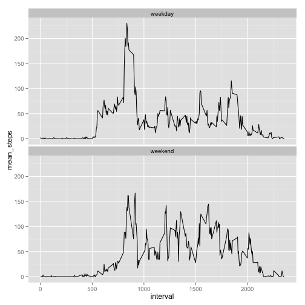

---
title: "PA1_template.Rmd"
author: "Russell Lin"
date: "2014-12-14"
output: html_document
---  
## Loading and preprocessing the data

```r
# Read the original data. No need to preprocess right now.
data_original <- read.csv("activity.csv")
```

## What is mean total number of steps taken per day?

```r
# Group the data based on date, Sum the total number of steps taken each day
library(plyr)
data_eachday <- ddply(data_original, c("date"), summarise,
                     total_steps = sum(steps, na.rm = TRUE)
                     )
# Make a histogram of the total number of steps taken each day
hist(data_eachday$total_steps, main = "Total Number of Steps Taken Each Day (simply omit missing values)",
     xlab = "Total steps each day")
```

 

```r
# Calculate the mean and median total number of steps taken per day
mean_perday = mean(data_eachday$total_steps, na.rm = TRUE)
median_perday = median(data_eachday$total_steps, na.rm = TRUE)
```
#### The mean total number of steps taken each day is 9354, the median is 10395.  

## What is the average daily activity pattern?

```r
# Make a time series plot of the 5-minuteinterval (x-axis) and the average number of steps taken,  averaged across all days (y-axis).
# Group the data by "interval"
data_eachInterval <- ddply(data_original, c("interval"), summarise,
                           mean_steps = mean(steps, na.rm = TRUE)
                           )
# Plot 
plot(data_eachInterval$interval, data_eachInterval$mean_steps,type = "l",
     main = "Average number of steps taken versus intervals across all days",
     xlab = "Interval", ylab = 'Average steps')
```

 

```r
# Which 5-minute interval, on average across all the days in the dataset, 
#  contains the maximum number of steps?
interval_max <- data_eachInterval$interval[which.max(data_eachInterval$mean_steps)]
```
#### The interval of 835 contains the maximum number of steps on average.

## Imputing missing values

```r
# Calculate and report the total number of missing values in the dataset
steps_count <- count(data_original, vars = "steps")
nrow_withNAs <- steps_count[is.na(steps_count$steps),]$freq
```
#### The total number of rows with missing values is 2304.  
#### The stategy for imputing missing data is to use  mean values for each 5-minute intervals .

```r
# Create a new dataset `data_imputed` that is equal to the original dataset but with 
# the missing data filled in with mean value for each 5-minute intervals .
data_imputed <- data_original
for (i in 1:nrow(data_original) ){
        if (is.na(data_original$steps[i])) {
                data_imputed$steps[i] <- data_eachInterval[data_eachInterval$interval
                                                   == data_original$interval[i],
                                                   ]$mean_steps
        }
        else {
                data_imputed$steps[i] <- data_original$steps[i]
        }
}
# Make a histogram of the total number of steps taken each day and 
data_eachday <- ddply(data_imputed, c("date"), summarise,
                      total_steps = sum(steps, na.rm = TRUE)
                )
hist(data_eachday$total_steps, main = " Total Number of Steps Taken Each Day (with imputed data)",
     xlab = "Total steps each day")
```

 

```r
# Calculate and report the mean and median total number of steps taken per day.
mean_perday_imputed = as.integer(mean(data_eachday$total_steps, na.rm = TRUE))
median_perday_imputed = as.integer(median(data_eachday$total_steps, na.rm = TRUE))
```
#### The mean total number of steps taken per day is 10766, the median is 10766.

## Are there differences in activity patterns between weekdays and weekends?

```r
Sys.setlocale(category = "LC_TIME", "en_US")
```

```r
# Create a new factor variable in the imputed dataset with two levels -- 
# "weekday" and "weekend" indicating whether a given date is a 
# weekday or weekend day.
data_imputed$day <- ifelse(weekdays(as.Date(data_imputed$date)) == "Saturday" |
                                   weekdays(as.Date(data_imputed$date)) == "Sunday",
                           c("weekend"), c("weekday")
                           )
data_imputed$day <- as.factor(data_imputed$day)

# Make a panel plot containing a time series plot (i.e. type = "l")
# of the 5-minute interval (x-axis) and the average number of steps taken, 
# averaged across all weekday days or weekend days (y-axis). 
# First, group the data by interval and weekday/weekend.
data_eachInterval <- ddply(data_imputed, c("interval","day"), summarise,
                           mean_steps = mean(steps)
                           )
# Then plot with ggplot system.
library(ggplot2)
```

```
## Use suppressPackageStartupMessages to eliminate package startup messages.
```

```r
p <- ggplot(data=data_eachInterval,
            aes(x=interval, y=mean_steps, group=1)) + geom_line()
p + facet_wrap(~day, ncol=1)
```

 

